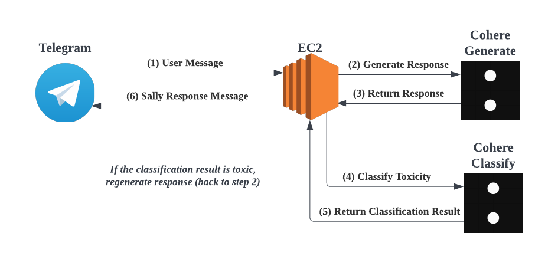

# Sally
Reconnect with your loved ones using Sally bot!

Telegram bot: [t.me/ReconnectWithSallybot](https://t.me/ReconnectWithSallybot)

Optional: You can upload you latest exported WhatsApp chat to have a better experience. The bot will have more context.

Built for [Cohere Thanksgiving Hackathon](https://lablab.ai/event/cohere-thanksgiving-hackathon)

<p align="center">   </p>

## Setup

1. Install all the requirement in `requirements.txt`
    ```bash
    pip install -r requirements.txt
    ```
2. Set environment variable needed for the Telegram Bot & Cohere API 
  * For the Telegram bot, the environment variable are:
    * TELEGRAM_BOT_TOKEN
    * TELEGRAM_BOT_USER_NAME
    * TELEGRAM_BOT_WEBHOOK_URL
  * For Cohere API, the environment variable are:
    * COHERE_API_KEY
3. Start the server under telebot folder
    ```bash
    python app.py
    ```
4. (if you wanna run it locally) Start ngrok reverse proxy
    ```bash
    ngrok http 9000
    ```

## What Happen on Each Message?

<p align="center">  </p>

* Checkout [/telebot/api/generate.py](/telebot/api/generate.py) to learn more about how we use Cohere's Generate API
* Checkout [/telebot/api/classify.py](/telebot/api/classify.py) to learn more about how we use Cohere's Classify API
